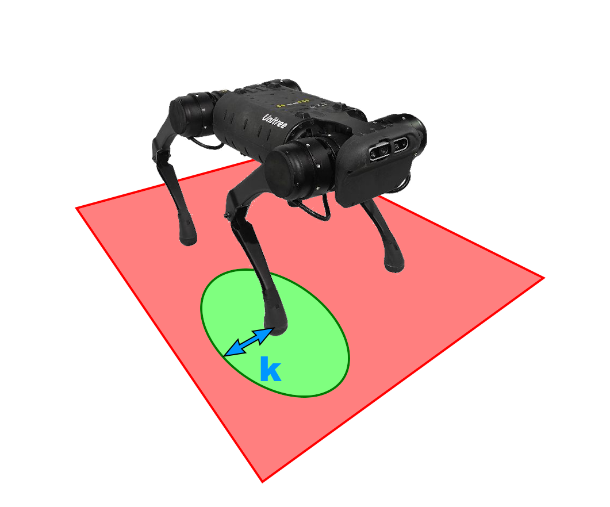
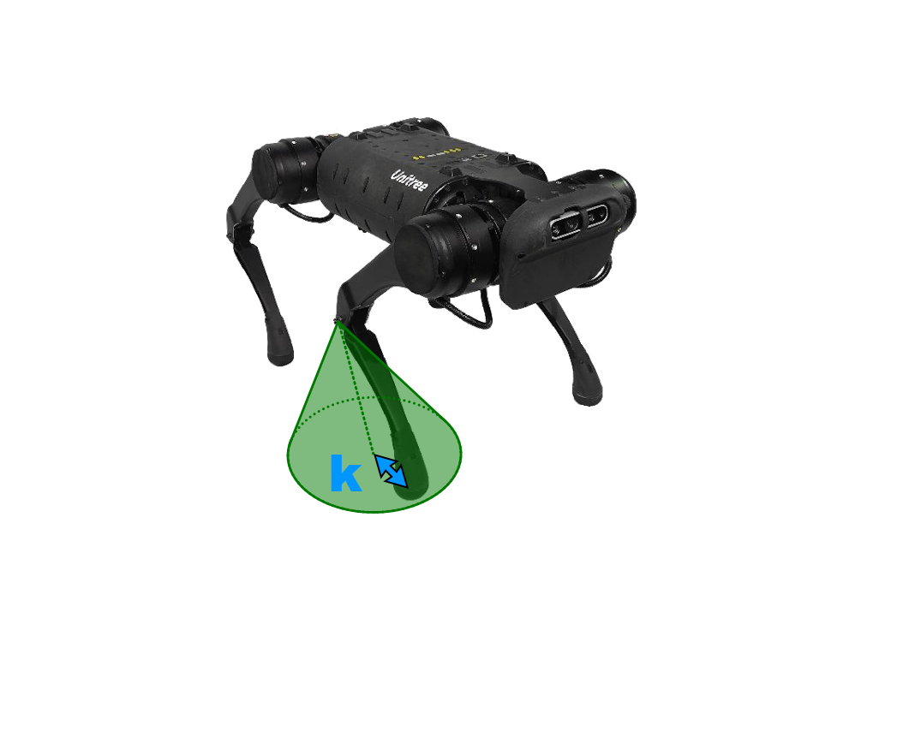
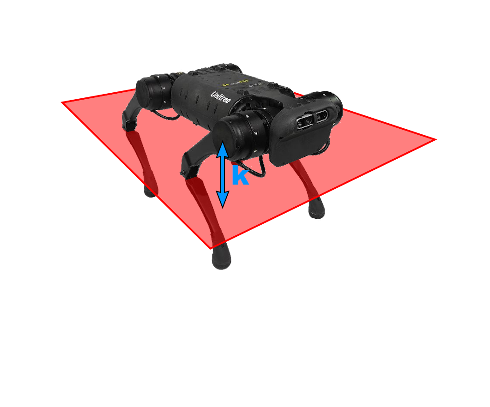
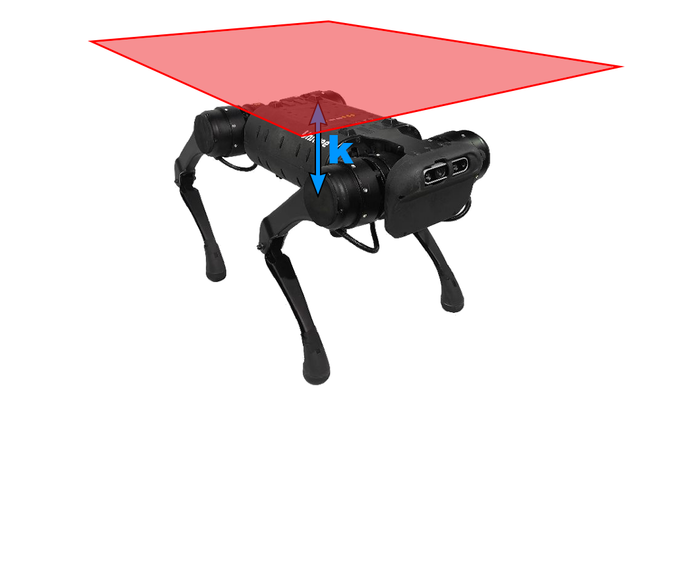

# Constrained Reinforcement Learning for Safe Quadruped Robot Locomotion

Implementation of a **parallel and optimized version of ATACOM** for safe quadruped locomotion using reinforcement learning.

The framework trains locomotion policies under safety constraints using **PPO** and the **MushroomRL** library.
This project was developed as part of a **Master Thesis**.

---

## Features

- Parallel implementation of the **ATACOM safety layer**
- Extensions of the **original ATACOM method**
- Reinforcement learning training pipeline based on **PPO**
- Safety constraints for quadruped locomotion

---

## Installation

This code was tested with **Python 3.10**.

### 1. Install MushroomRL

```bash
git clone https://github.com/MushroomRL/mushroom-rl.git
cd mushroom-rl
git checkout d9a8a99287549f06065b7c75e5a92af0ffb4b5c5
python -m pip install -e .
cd ..
```

### 2. Install quadruped-atacom

```bash
git clone https://github.com/paolo-magliano/quadruped-atacom.git
python -m pip install -e quadruped-atacom
```

---

## Quick Start

Run a training experiment on the Unitree A1 environment:

```bash
cd quadruped-atacom
python experiments/run_exp_a1.py
```

Experiment parameters can be configured through **Hydra configuration files**.

---

## Constraints

Safety constraints can be applied to different parts of the robot:

- **Joint position limits**
- **Foot position and orientation constraints**
- **Base height constraints**

### Foot position and orientation constraints

<p align="center">
  
  
</p>

<p align="center">
The <strong>foot position constraint</strong> limits the foot position inside a predefined workspace around the nominal pose.  
The <strong>foot orientation constraint</strong> restricts the foot rotation when approaching ground contact to ensure stable landing.
</p>

### Base height constraints

<p align="center">
  
  
</p>

<p align="center">
Minimum and maximum base height constraints prevent the robot base from moving outside a safe vertical range during locomotion.
</p>

## Environments

Currently available environments:

- **Unitree A1**

The **Anymal C environment is currently not working** and should not be used.

---

## Notes

The parallel computational cost of ATACOM is currently limited by the PyTorch function `lstsq`, which solves batches of linear systems and scales approximately linearly with the batch size.  
An evaluation of alternative methods and optimizations is provided in the `lstsq` subfolder, although none of them currently achieve comparable parallel performance. Once this bottleneck is improved, the overall computation time will decrease significantly.
